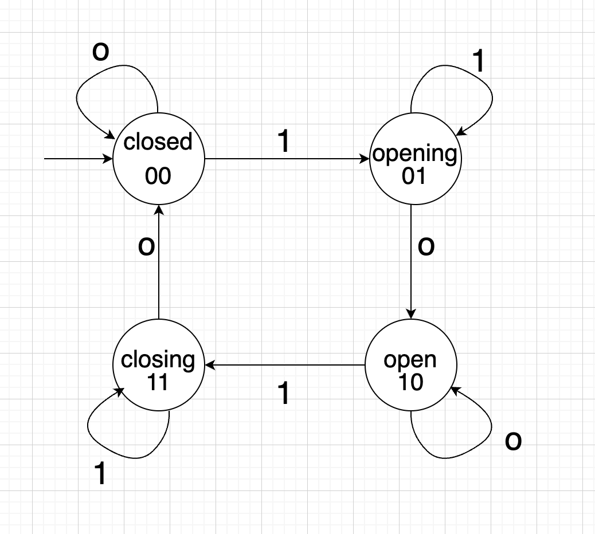
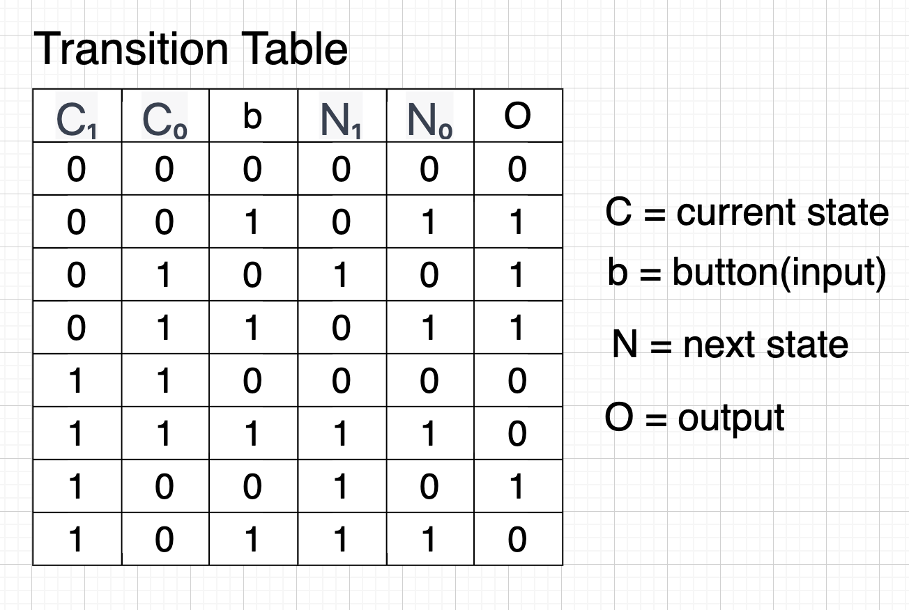
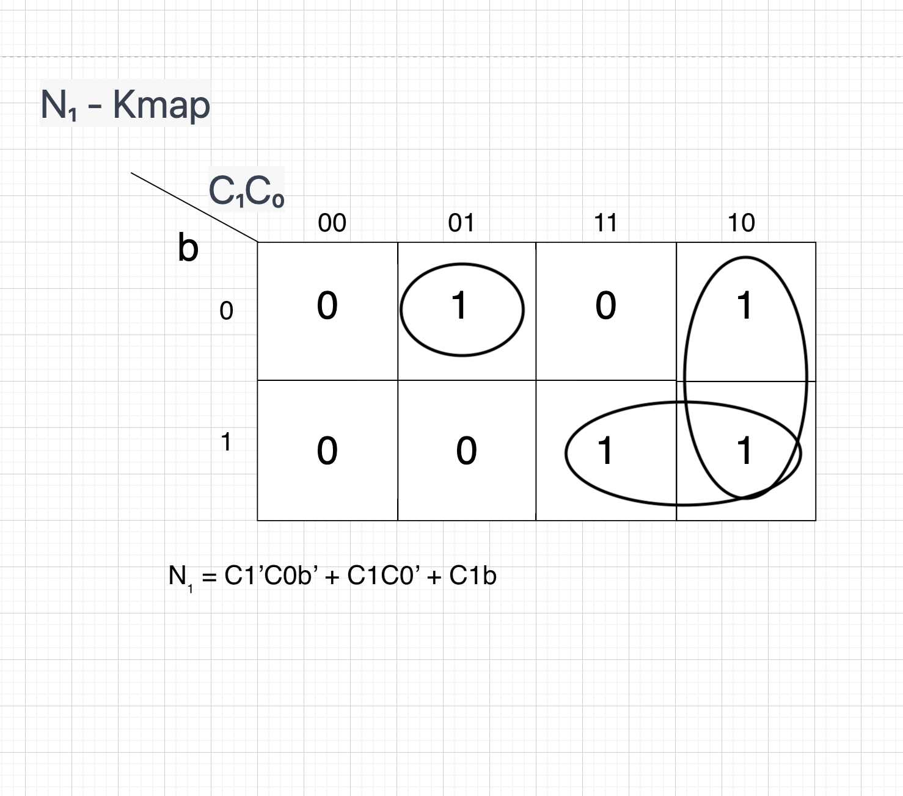
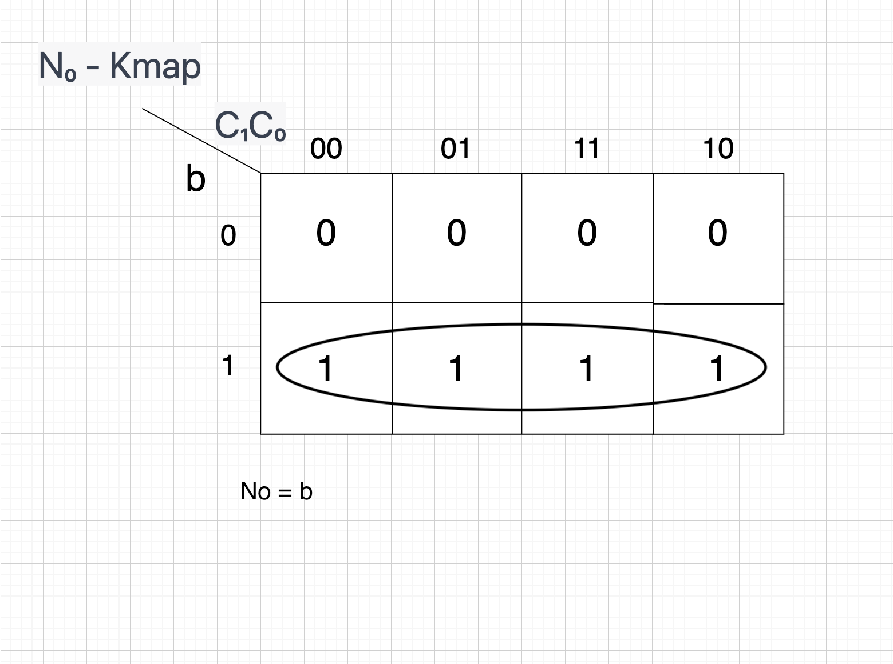
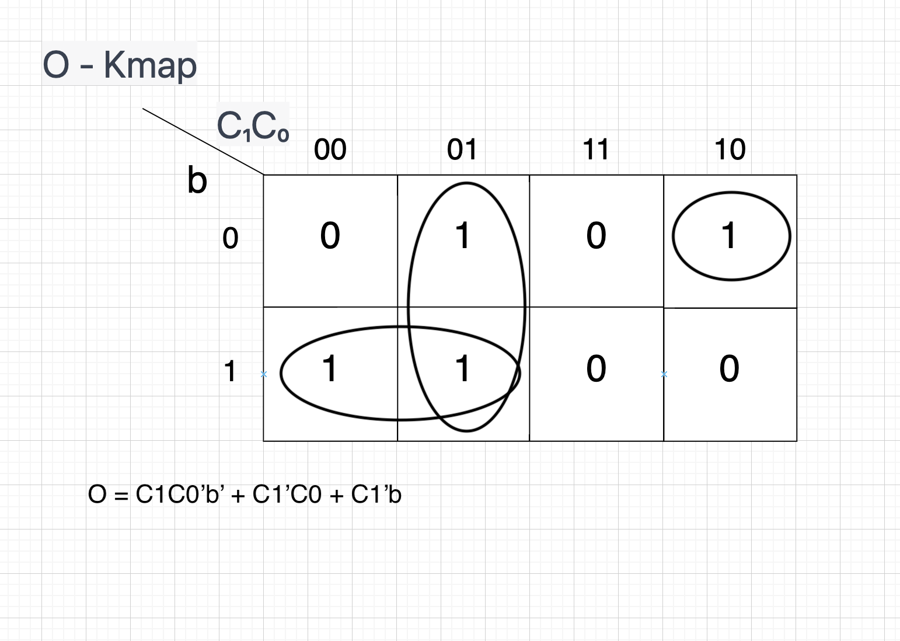
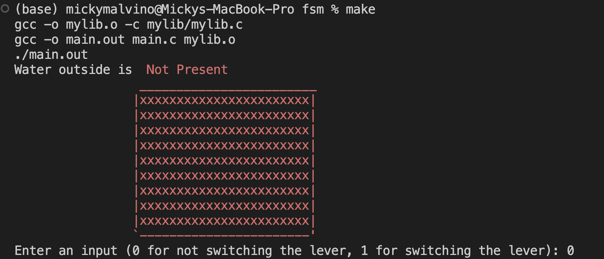
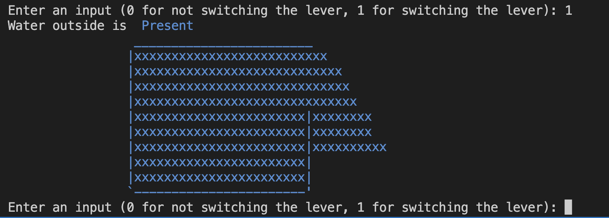

# Finite State Machine(FSM) for a dam 🌊
A finite state machine (FSM) is a mathematical model that can be used to represent and control the behavior of a system. It consists of a set of states, transitions between those states, and rules for changing states.

## Description
In this FSM, there are four states that represent the different possible configurations of the dam: closed, opening, open, and closing. The transitions between these states are triggered by inputs such as commands to open or close the dam. The output of the FSM is the presence of water💦

State 1 (Dam is closed): In this state, the dam is fully closed and no water is flowing through it.
State 2 (Dam is opening): In this state, the dam is in the process of opening. This might involve the movement of gates or other mechanical components to allow water to flow through the dam.
State 3 (Dam is open): In this state, the dam is fully open and water is flowing through it.
State 4 (Dam is closing): In this state, the dam is in the process of closing. This might involve the movement of gates or other mechanical components to block the flow of water through the dam.
The transitions between these states are triggered by the switch of a lever🕹️. For example, if the dam receives a command to open, by switching the lever, it will transition from State 1 (closed) to State 2 (opening). When the opening process is complete, the dam will transition from State 2 to State 3 (open). Similarly, if the dam receives a command to close, by switching the lever, it will transition from State 3 (open) to State 4 (closing), and then to State 1 (closed) when the closing process is complete.

The output of the FSM is the current status of the area regarding presence of water. This output can be used by other systems or devices that need to know the state of the dam in order to function correctly.

Here is my example of an FSM that could be used to represent the working of a dam, complete with a diagram of 4 states, transition table, karnaugh map, combinatorial boolean equations from K-map, and simulated in C language.

## Diagram:



Gray code is used in finite state machines (FSMs) to encode the state of the machine. It has the property that each successive value has only one bit that is different from the previous value, which makes it useful for encoding states because it allows for smooth transitions between states and reduces the risk of errors occurring during state transitions. Gray code is also efficient at encoding a large number of states using a small number of bits, which makes it possible to design FSMs with more states. The use of gray code in FSMs is motivated by the desire to improve the reliability and efficiency of state encoding.

## 4 states:
* State 1: Dam is closed (initial state)
* State 2: Dam is opening
* State 3: Dam is open
* State 4: Dam is closing

## Transitions:
* From State 1 to State 2: Dam opening command is received
* From State 2 to State 3: Dam is fully open
* From State 3 to State 4: Dam closing command is received
* From State 4 to State 1: Dam is fully closed

## Input: 
switch of a lever
(0 or 1)

* 1 signifies lever switched
* 0 signifies lever not switched

## Output: 
presence of water

* 1 for yes
* 0 for no

## Transition Table


## Karnaugh map along with combinatorial boolean equations from K-map
We have 3 K-maps, one for finding the N₁, which is the first value next state.

The next is for finding N₀, which is the second value for the next state.

Lastly to find the output O.






# Running the C program
type in the following command in vsc terminal:
```
make
```
then type in 0 or 1 whether you want to switch the lever or not to progress through the states in the fsm

result should look something like this:



